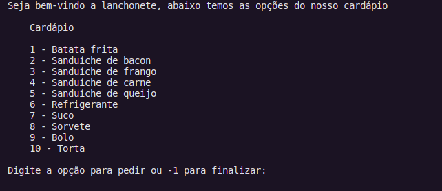

# Sistema de Pedidos



## Projeto

<p>Sistema de pedidos é basicamente um sistema de uma lanchonete em que será mostrado o cardápio com várias opções para adicionar a lista de pedidos e após a sua finalização terá outra função com uma sequência de opções que o cliente pode fazer.</p>

## Funcionalidades

<ol>
    <li>Adicionar um novo pedido na lista</li>
    <li>Remover um pedido já selecionado</li>
    <li>Mostrar os pedidos</li>
    <li>Mostrar os pedidos em forma de lista duplamente encadeada</li>
</ol>


## Como executar

<p>Clone o projeto em seu dispositivo e acesse a pasta do mesmo, para em seguida pode acessar pelo seu editor.</p>

```
$ git clone https://github.com/Lara123-pg/Projeto-de-Estrutura-de-Dados.git
$ cd Projeto-de-Estrutura-de-Dados
$ code . (Para abrir o projeto direto no Visual Studio Code)
```

## Como executar via Docker

<p>Para baixar a imagem, utilize o comando abaixo:</p>

```
$ docker pull larafernanda/projetoestruturadados
```

<p>Para executar a imagem, utilize o seguinte comando:</p>

```
$ docker run -ti larafernanda/projetoestruturadados
```

## Licença

<p>Este projeto está sob a licença MIT -</p>